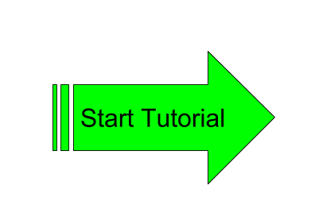

# Tutorial for the DSpace REST Report Tools

The DSpace 6.0 release contained a set of reporting tools built upon the DSpace REST API.  See https://wiki.duraspace.org/display/DSPACE/DSpace+Release+6.0+Status

## DSpace 6.3: Related Jira Tickets/Pull Requests

Issue | Jira | Pull Request
----- | ---- | ------------
Add Bitstream Metadata to REST Reports | [DS-3704](https://jira.duraspace.org/browse/DS-3704) | [PR 1854](https://github.com/DSpace/DSpace/pull/1854)
Fix Permision Check by Bundle Name     | [DS-3713](https://jira.duraspace.org/browse/DS-3713) | [PR 1863](https://github.com/DSpace/DSpace/pull/1863)
Include Withdrawn Items in Coll Report | [DS-3714](https://jira.duraspace.org/browse/DS-3714) | [PR 1862](https://github.com/DSpace/DSpace/pull/1862)
Integrate Shibboleth with the REST Report Tools | [DS-3811](https://jira.duraspace.org/browse/DS-3811) | [PR 1934](https://github.com/DSpace/DSpace/pull/1934)

