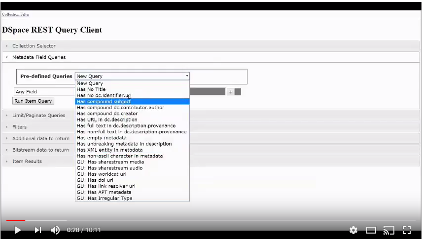

[Setup](setup/README.md) | [Demo 1](demo1/README.md) | [Demo 2](demo2/README.md) | [Demo 3](demo3/README.md) | [Demo 4](demo4/README.md) | [Demo 5](demo5/README.md) | [Demo 6](demo6/README.md)
------------------------- | ------------------------- | ------------------------- | ------------------------- | ------------------------- | ------------------------- | ------------------------- 
# Tutorial for the DSpace REST Report Tools



The DSpace 6.0 release contained a set of reporting tools built upon the DSpace REST API.  See https://wiki.duraspace.org/display/DSPACE/DSpace+Release+6.0+Status

_TODO: Migrate this tutorial repo to DSpace-Labs_

## Purpose of the DSpace REST Report Tools
These report tools allow a repository manager to enforce metadata standards and bitstream policies across their collections.

## Introduction
This video provides an overview of the DSpace REST Report Tools.

The DSpace instance shown in this video contains some customized enhancements beyond the base tools release in DSpace 6.0.  The tutorial will highlight those extended features.

## Try it yourself
- [Setup The Tutorial](setup/README.md)
- [Demo 1: Metadata Load and Update](demo1/README.md)
  - This demo will be run on demo.dspace.org.
- [Demo 2: Item Special Cases - Exploring Filters](demo2/README.md) 
  - This demo will be run on demo.dspace.org.
- [Demo 3: Ingest Items with Zero, One, and Two Items (PDF and Docs)](demo3/README.md)
  - This demo will be run on demo.dspace.org.
- [Demo 4: Ingest Items with Embargo](demo4/README.md)
  - This demo will be run on demo.dspace.org.
- [Demo 5: View Bitstream Properties](demo5/README.md)
  - This demo will be run on a server running PR 1854 (targeted for DSpace 6.?)
- [Demo 6: Highlight Custom Extensions to the the REST Query Tools](demo6/README.md) 
  - This demo will feature custom extensions to the DSpace REST Report Tools.
  
## DSpace 6.2: Related Jira Tickets/Pull Requests

Issue | Jira | Pull Request
----- | ---- | ------------
Add Bitstream Metadata to REST Reports | [DS-3704](https://jira.duraspace.org/browse/DS-3704) | [PR 1854](https://github.com/DSpace/DSpace/pull/1854)
Fix Permision Check by Bundle Name     | [DS-3713](https://jira.duraspace.org/browse/DS-3713) | [PR 1863](https://github.com/DSpace/DSpace/pull/1863)
Include Withdrawn Items in Coll Report | [DS-3714](https://jira.duraspace.org/browse/DS-3714) | [PR 1862](https://github.com/DSpace/DSpace/pull/1862)
Integrate Shibboleth with the REST Report Tools | [DS-3811](https://jira.duraspace.org/browse/DS-3811) | [PR 1934](https://github.com/DSpace/DSpace/pull/1934)

[Setup](setup/README.md) | [Demo 1](demo1/README.md) | [Demo 2](demo2/README.md) | [Demo 3](demo3/README.md) | [Demo 4](demo4/README.md) | [Demo 5](demo5/README.md) | [Demo 6](demo6/README.md)
------------------------- | ------------------------- | ------------------------- | ------------------------- | ------------------------- | ------------------------- | ------------------------- 
