[Main Menu](../README.md)    | [Next](../demo3/README.md)
------------------ | -----------------

## Demo 2: Item Special Cases - Exploring Filters

This demo will be run on demo.dspace.org.

### Query for items containing "TODO" in dc.description.abstract

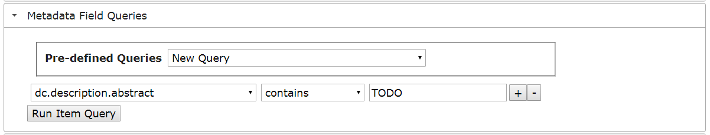

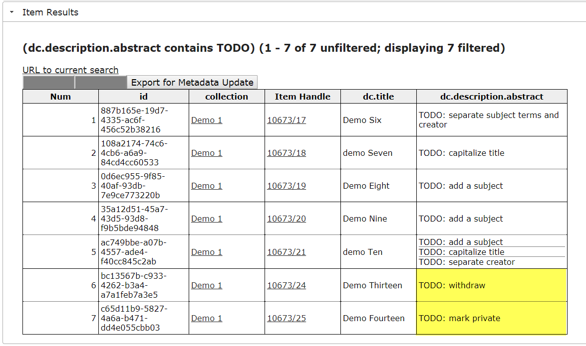

### In DSpace, edit the item "TODO: withdraw" and Withdraw it

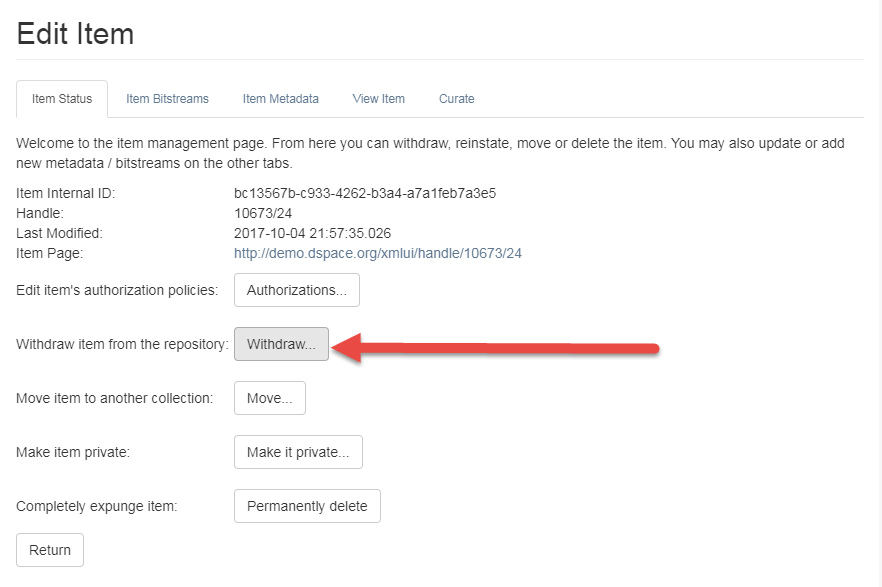

### In DSpace, edit the item "TODO: make private" and Make it private

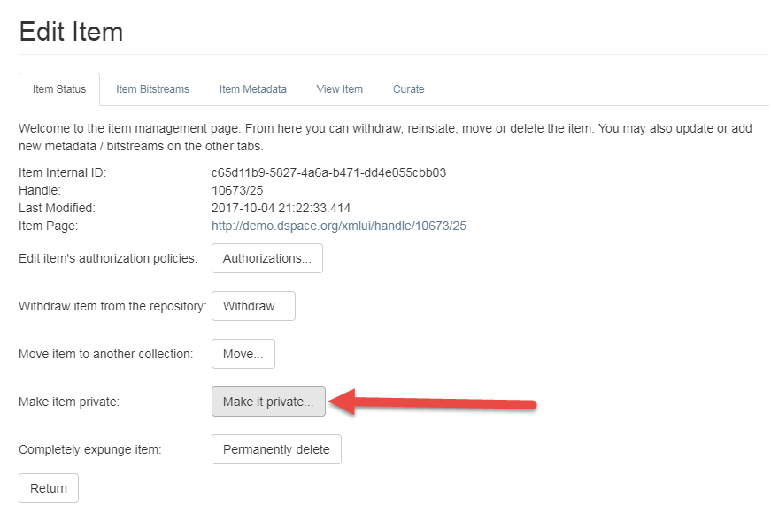

### Rerun the query tool, note that the withdrawn item does not appear

Items that a user cannot access will be filtered from the result set (unless you override this behavior in code)

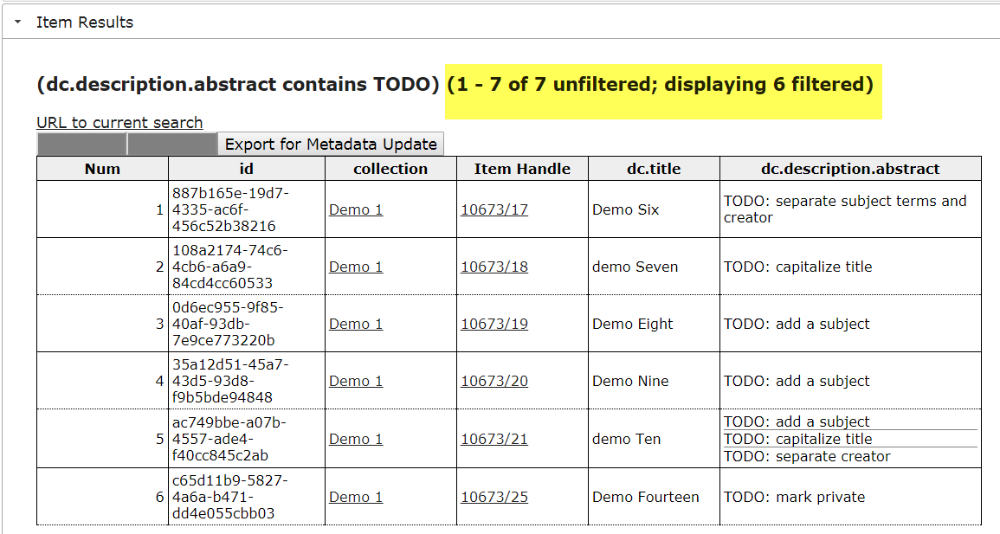

### Login to the REST interface to include withdrawn items in the report

- In a new tab, open https://demo.dspace.org/rest/static/reports/authenticate.html
- Sign in as __dspacedemo+admin@gmail.com__

### RE-run the TODO query

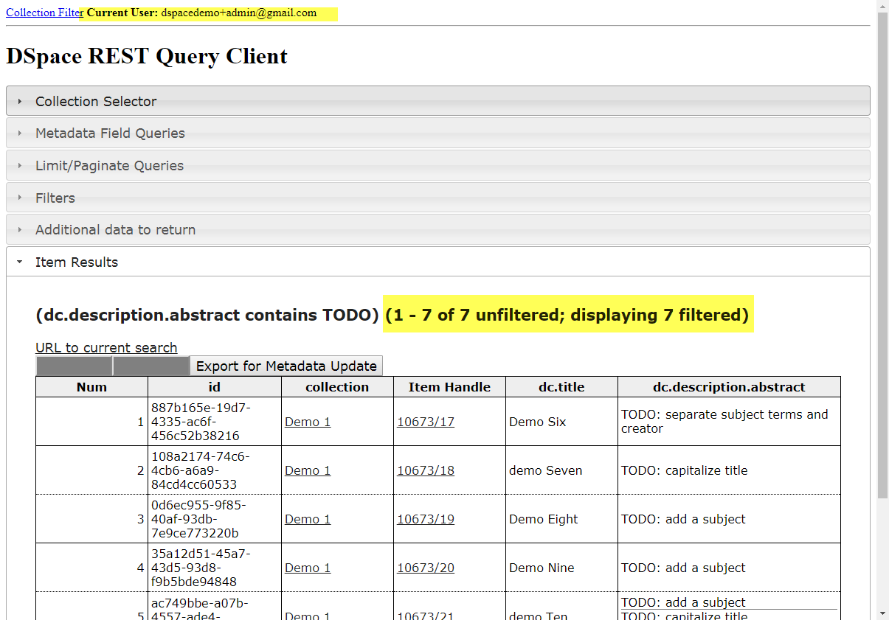

## Collection Report - Special Filters

Open the "Collection Filter" Report: https://demo.dspace.org/rest/static/reports/index.html

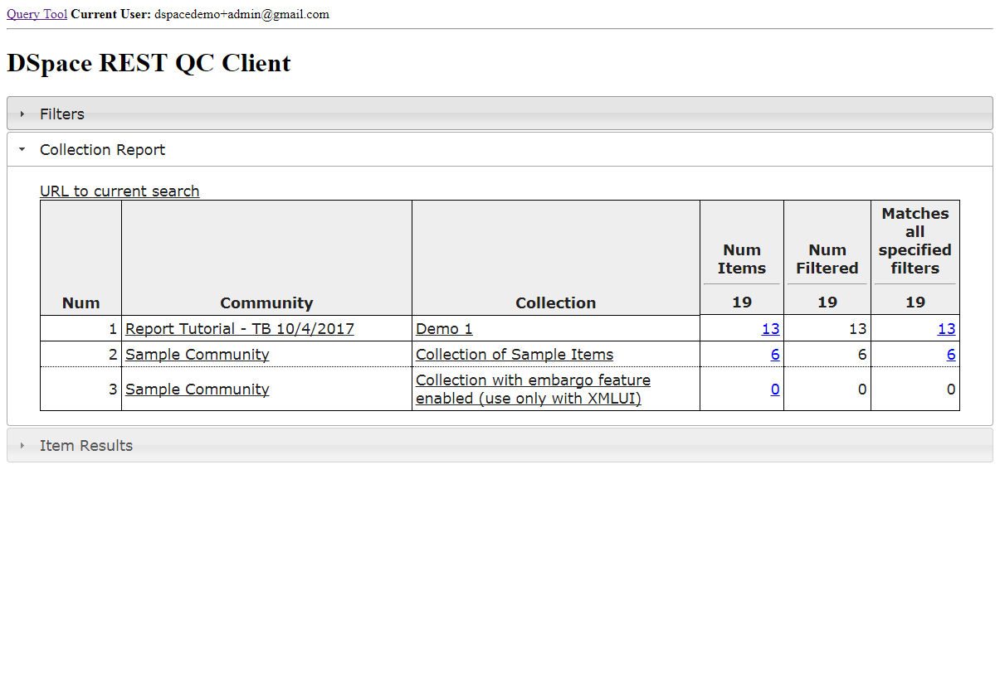

### Set Filters to View Counts of Private and Discoverable Items

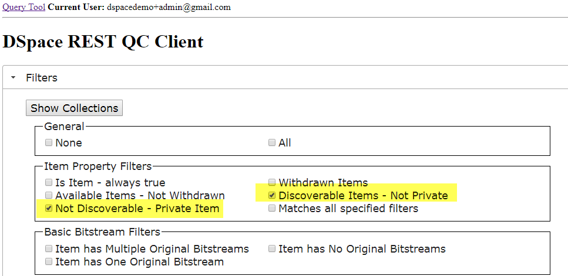

### View Filter Counts

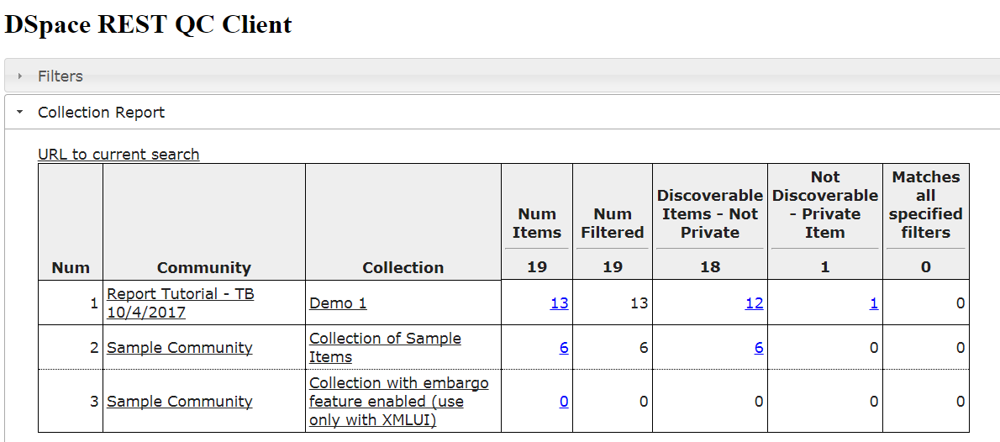

### View Private Items for a Collection

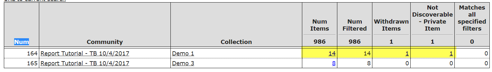

### View Withdrawn Items for a Collection

#### Bug in DSpace 6.2
* See https://jira.duraspace.org/browse/DS-3714

### Add dc.description.abstract to Item Listing

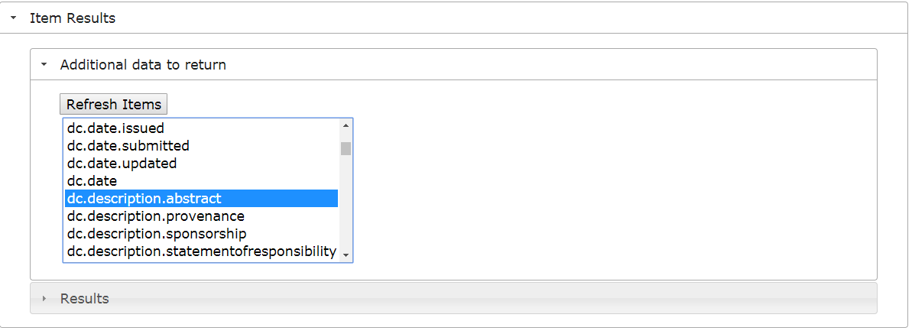

### View Item Listing with dc.description.abstract

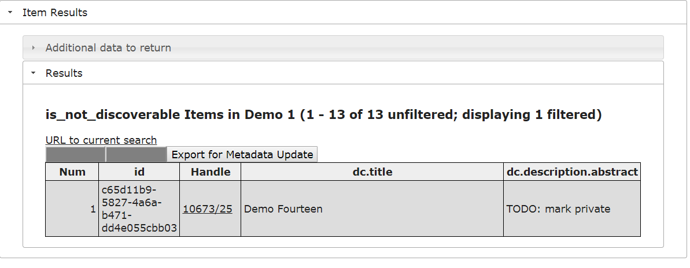

[Main Menu](../README.md)    | [Next](../demo3/README.md)
------------------ | -----------------
