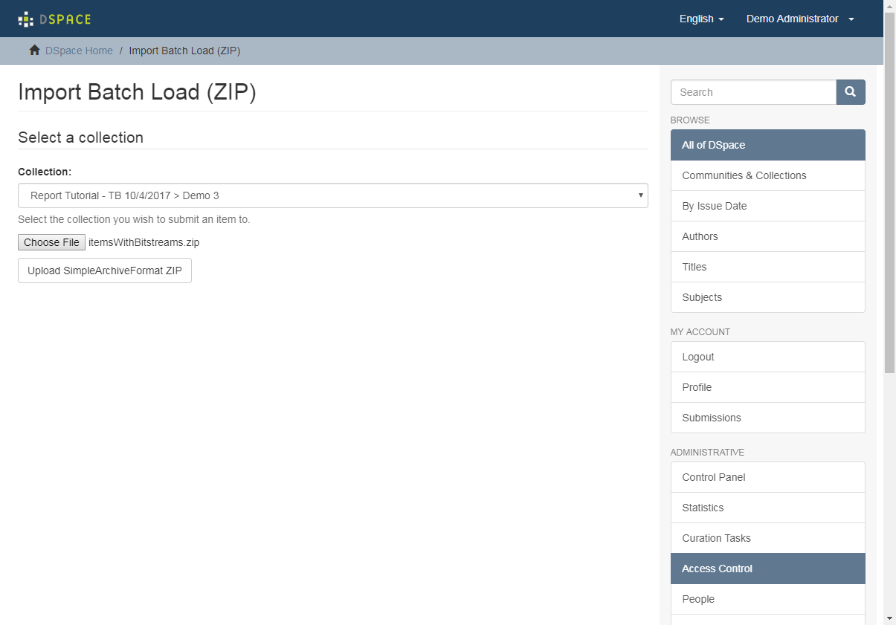
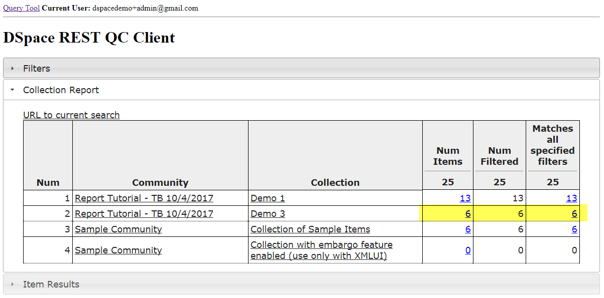
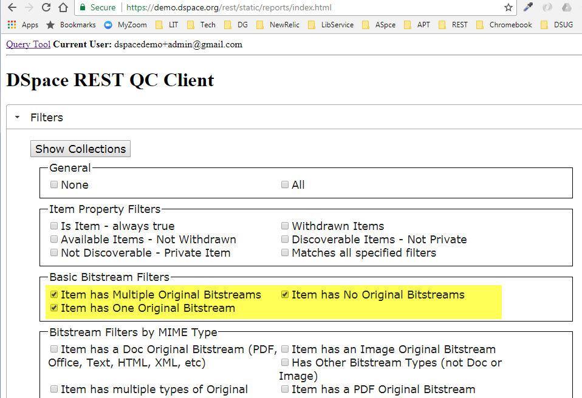
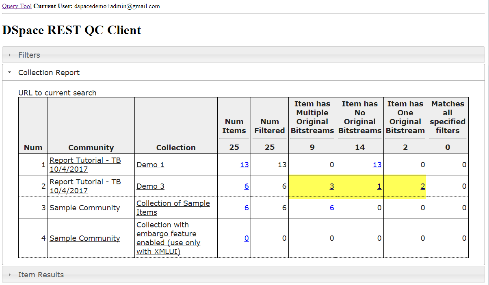
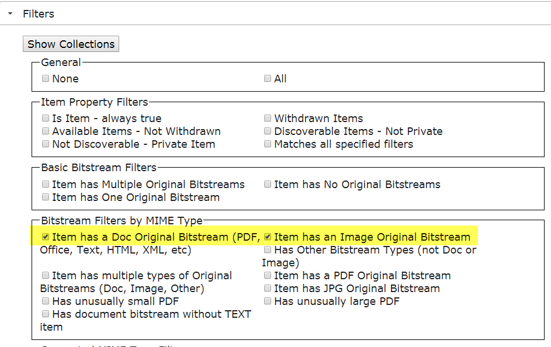
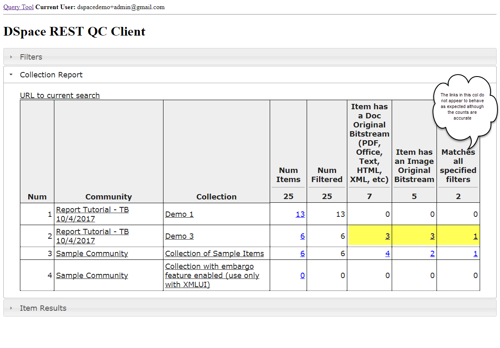

## Demo 3: Ingest Items with Zero, One, and Two Items and apply Bitstream Filters



This demo will be run on demo.dspace.org.

The file [itemsWithBitstreams.zip]({{site.src_dir}}data) will be used to populate a collection used in this demonstration.

<a href="{{site.src_dir}}/data">itemsWithBitstreams.zip</a>...

You can browse the contents of this zip file [here](data/itemsWithBitstreams).

### In your test community, create a new Collection Named "Demo 3".  Ingest the __itemsWithBitstreams.zip__.

## Query for Items based on Bitstream Filters

### Open the Collection Report

### Set the Filter based on Original Bitstream Count
This report can be used to ensure consistent bitstream content within a collection.

### Set the Filter based on Original Bitstream Type (Document or Image)
This report can be used to ensure consistent bitstream content within a collection.
If this filter is paired with the metadata query tool, it can be used to enforce required metadata for a specific bitstream type.


