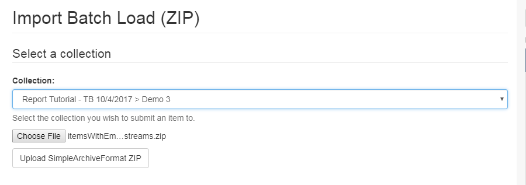
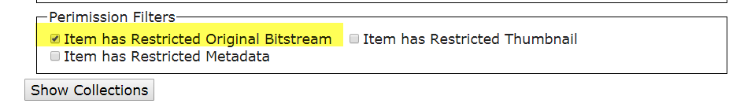
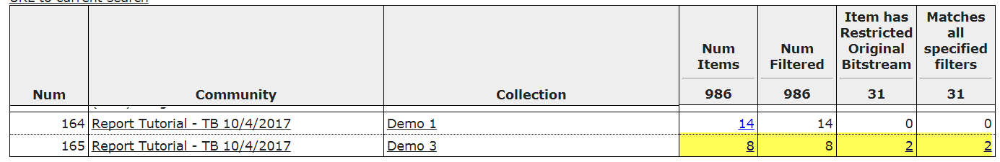

[Main Menu](../README.md)    | [Next](../demo5/README.md)
------------------ | -----------------

### Demo 4: Ingest Items with Embargos

 There is a bug in the detection of restricted bitstreams in DSpace 6x.  It cannot yet be tested on demo.dspace.org.
* See https://jira.duraspace.org/browse/DS-3713
* See https://github.com/DSpace/DSpace/pull/1863

The file [itemsWithEmbargoBitstreams.zip](data) will be used to populate a collection used in this demonstration.  The contents file for each item sets a read restriction for the group Administrator for each item.

You can browse the contents of this zip file [here](data/itemsWithEmbargoBitstreams).

### Set a filter to query for items with a restricted original bitstream (not visible to anonymous group)

### In your test community, create a new Collection Named "Demo 3".  Ingest the __itemsWithEmbargoBitstreams.zip__.

[Main Menu](../README.md)    | [Next](../demo5/README.md)
------------------ | -----------------
