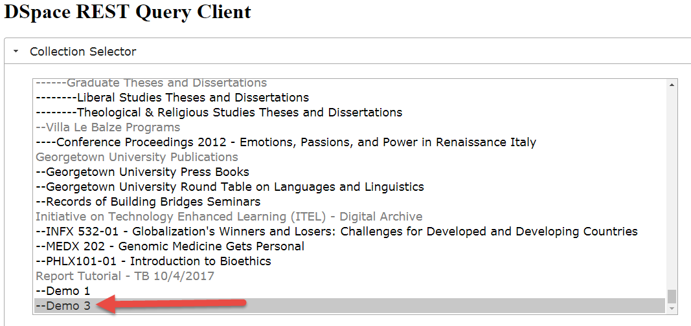
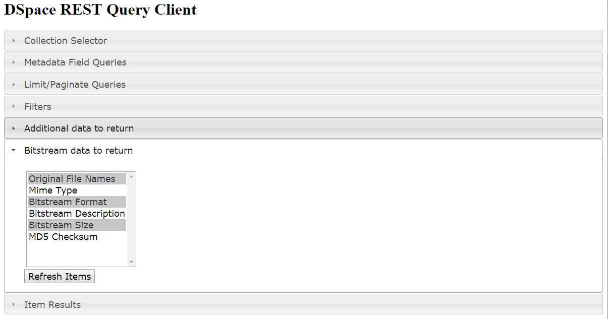
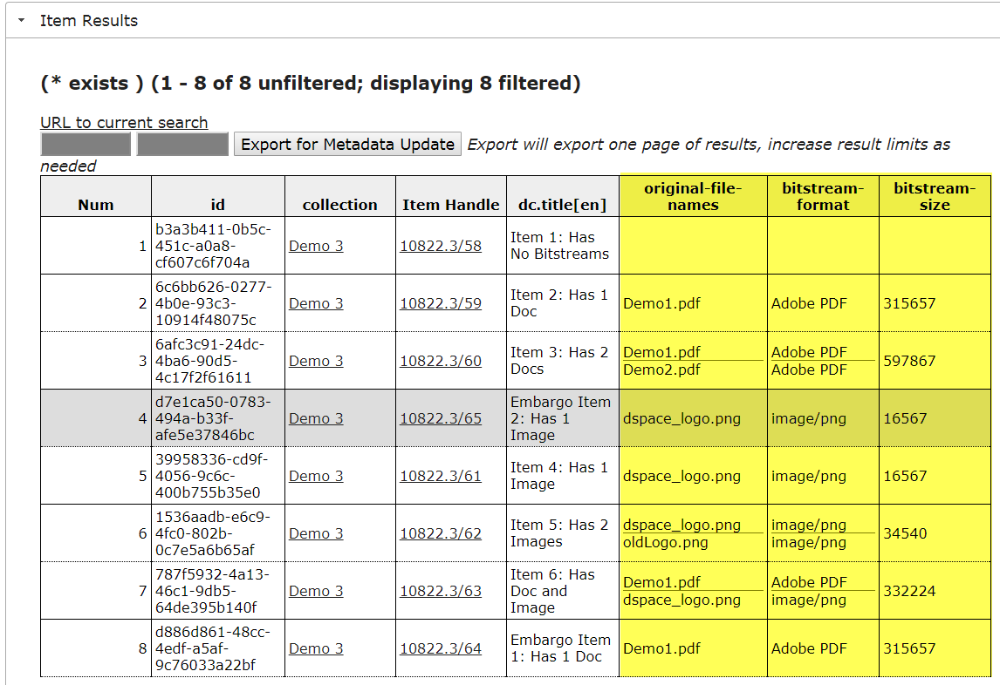

## Demo 5: View Bitstream Properties



### DSpace 6.3 Code Dependency
This demo will be run on a server running an enhanced version of the report tools that extract bitstream properties. This will be included in the DSpace 6.3 release.  It cannot yet be tested on demo.dspace.org.
* See https://jira.duraspace.org/browse/DS-3704
* See https://github.com/DSpace/DSpace/pull/1854

### Search Collection Demo 3

### Add Bitstream Properties to the Result Set

### View Results


