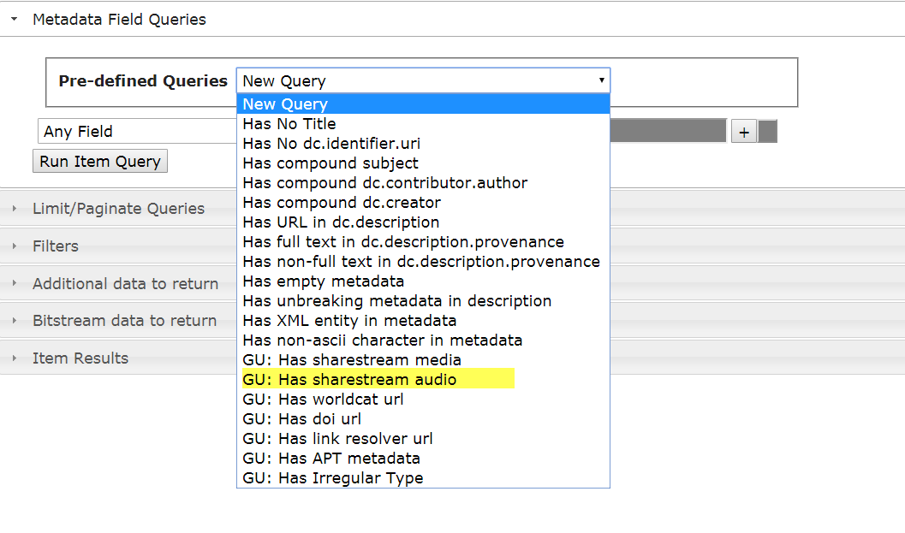
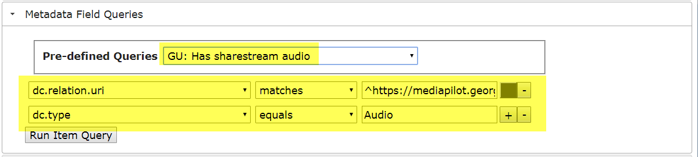
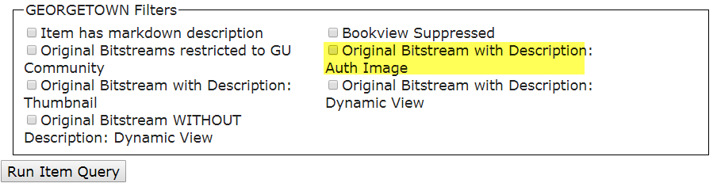
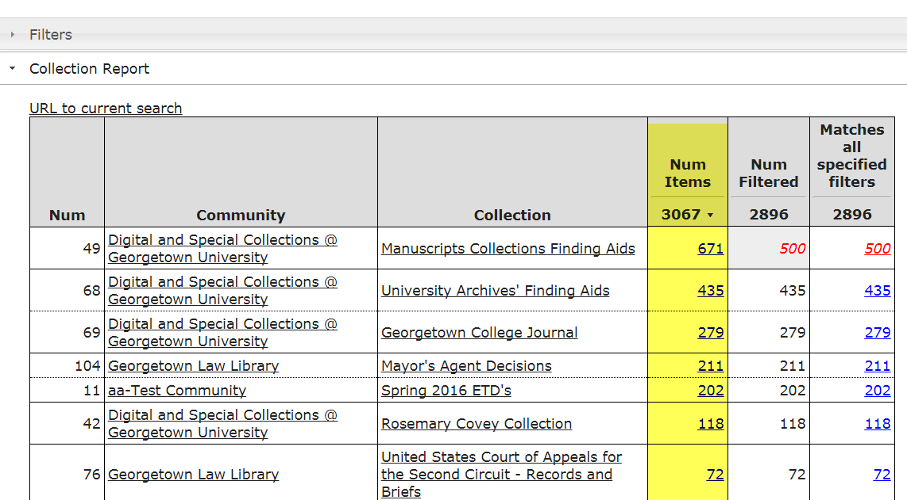
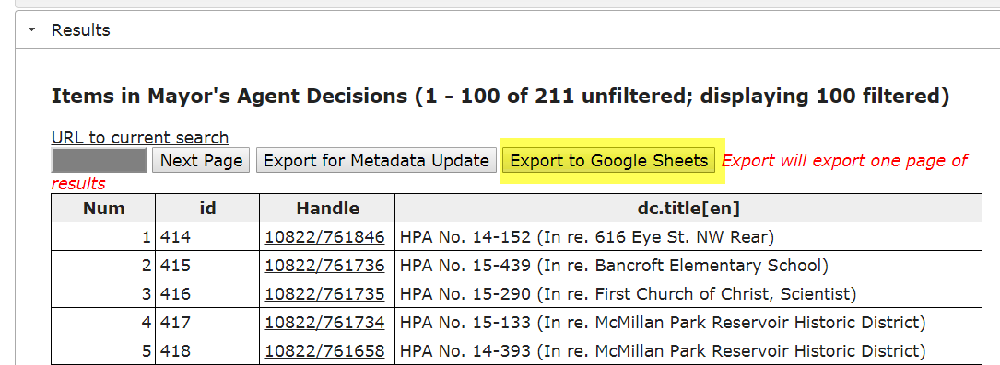

## Demo 6: Highlight Custom Extensions to the the REST Query Tools 



This demo will feature custom extensions to the DSpace REST Report Tools.

## Adding Custom Queries to the Query Tool

The query tool can be easily expanded to view/enforce local metadata conventions.

### Code example - Add Query

See https://github.com/DSpace/DSpace/blob/dspace-6.2/dspace-rest/src/main/webapp/static/reports/restQueryReport.js#L200-L246

### Code example: Add Query to the List

         this.initQueries = function() {
                $("#predefselect")
                  .append($("<option value='gu2'>GU: Has sharestream audio</option>"))

### Code example: Set Metadata Query
         } else if (val ==  'gu2') {
                self.drawFilterQuery("dc.relation.uri","matches","^https://mediapilot.georgetown.edu.*$");                                            
                self.drawFilterQuery("dc.type","equals","Audio");                                             
         }

## Adding Custom Filters

### Code Example: Custom Filter

    public class ItemFilterDefsGU implements ItemFilterList {
        public static final String CAT_GU = "GEORGETOWN Filters";
        private enum EnumItemFilterDefs implements ItemFilterTest {
            stream_auth_image("Original Bitstream with Description: Auth Image", null, CAT_GU) {
                public boolean testItem(Context context, Item item) {
                        return ItemFilterUtil.countBitstreamByDesc(BundleName.ORIGINAL, item, "Sharestream Auth Image") > 0;
                }
            },
  
## Making Results Sortable
Using code from https://kryogenix.org/code/browser/sorttable/, you can make the tables in the report tools sortable.

To enable this feature, add sorttable.js to your distribution and enable the following feature in __restReport.js__

    //Override this method is sortable.js has been included
    this.hasSorttable = function() {
      return false;
    }

## Enabling an Export to Google Sheets

See https://github.com/terrywbrady/PlainTextCSV_GoogleAppsScript to enable a Google Apps Script service that will create a Google Sheet from CSV.

    this.gsheet = function(rows) {
      var form = $("<form/>");
      $("#itemdiv").append(form);
      form.hide();
      form.attr("method","POST");
      form.attr("action","https://script.google.com/a/macros/<<your-domain>>/s/<<your-app>>/exec");
      var input = $("<textarea rows='10' cols='100'/>");
      input.attr("name","data");
      input.val(this.makeCsv(rows));
      form.append(input);
      input = $("<input type='submit'/>");
      form.append(input);
      form.submit();
    }

  

