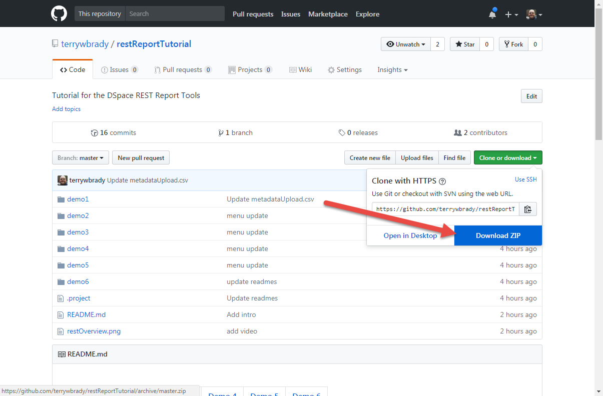
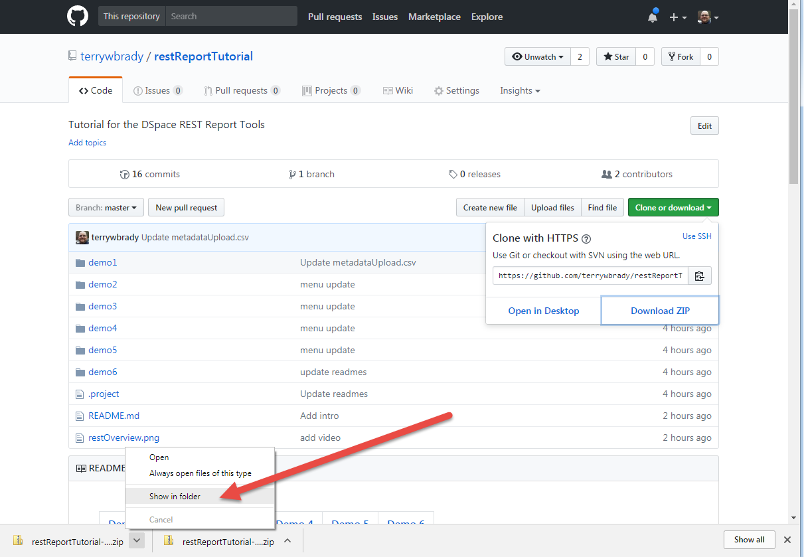
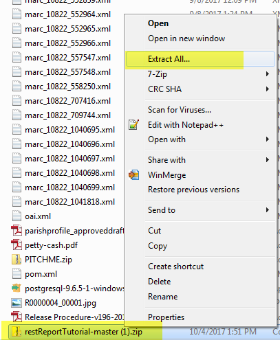
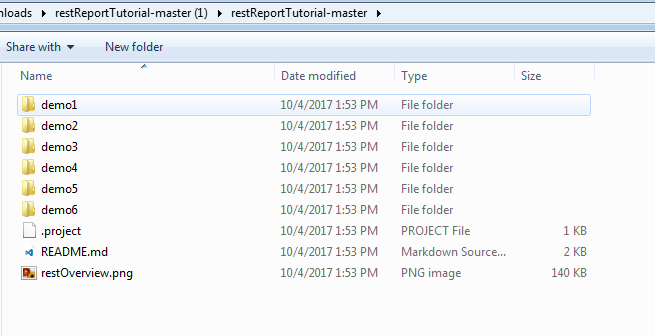
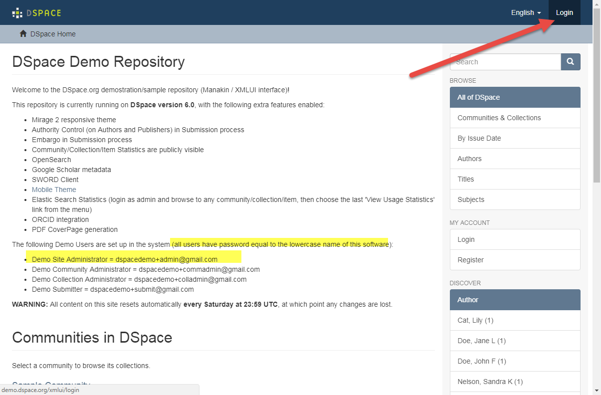
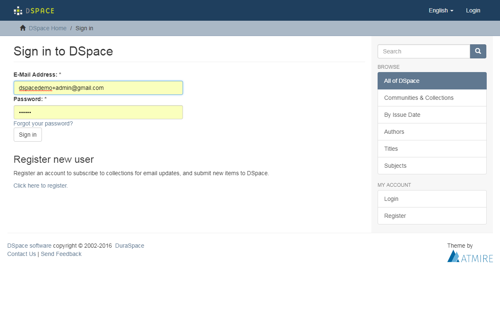
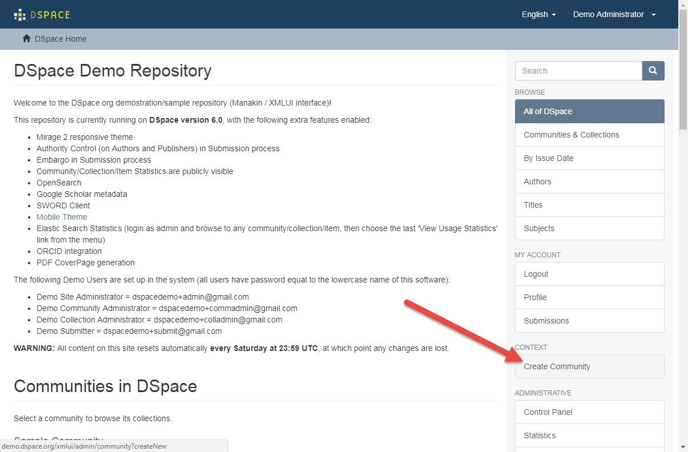
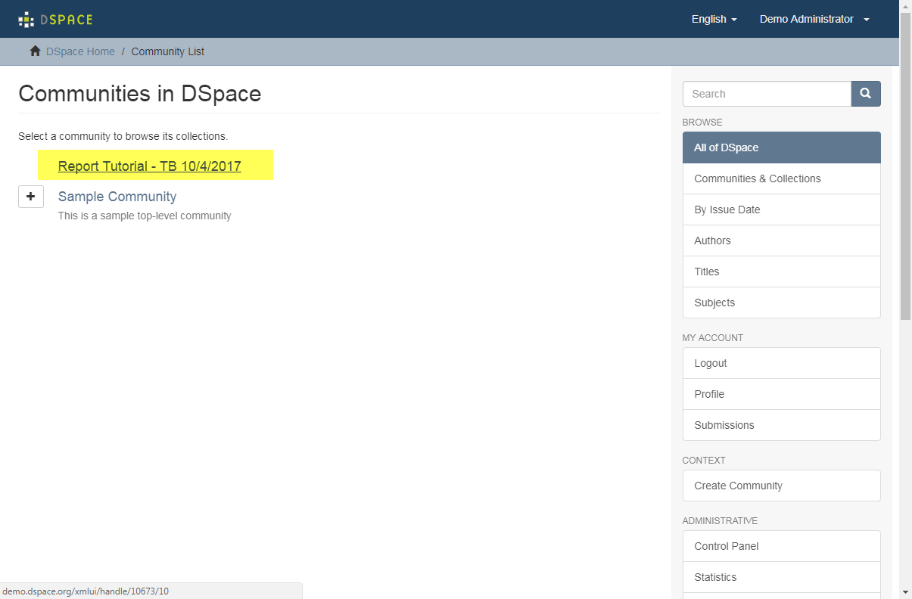
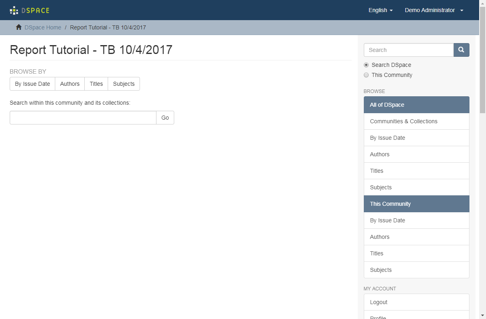

## Tutorial Setup



###  Clone this repository from GitHub 
This will provide you with the resources for running this tutorial/

- If you have a git client, clone the repository
- Otherwise, download the repository as a zip file and extract it

#### Click "Clone or Download" then click "Download Zip"

#### Open and extract file contents

  
### Create your own Community on demo.dspace.orge

#### Sign on as Site Administrator

- Got To http://demo.dspace.org
- On the landing page, note the login information for __Demo Site Administrator__
- Sign on as an administrator

  

### Create a new community and put the date and your initials in the community name


